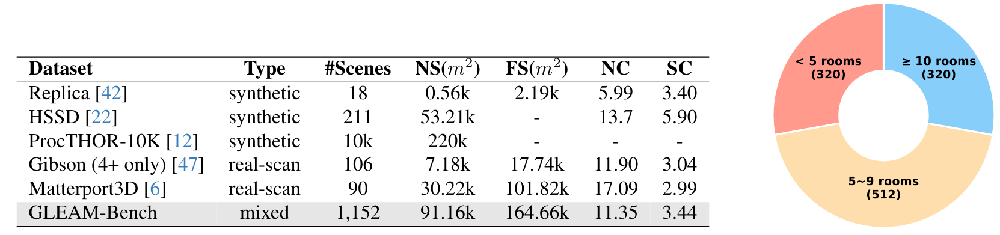

# Batch-Export-Meshes-from-Generated-Scenes-by-ProcTHOR

> [!TIP]
> These scripts are designed to create large-scale scene meshes for robot learning. Our work for generalizable indoor active mapping can be found in https://github.com/zjwzcx/GLEAM.

## 📋 Overview
We provide automated scripts for batch exporting `.fbx` meshes from ProcTHOR-format generated scene descriptions (e.g., ProcTHOR-10K JSON files). This pipeline facilitates large-scale dataset creation for robotics and computer vision research.


## 🛠️ Software

We test our code under the following environment:
- Unity Hub 3.11.0
- Unity Editor 2021.3.45f1
	- FBX exporter 4.1.0 (Unity package. You can install it in Unity's package manager.)


## 🕹️ Get Started

1. Clone the AI2-THOR repository:

```bash
git clone https://github.com/allenai/ai2thor.git
```

2. Merge provided scripts into AI2-THOR file structure:


```
ai2thor
└── unity
    └── Assets
        ├── Editor
        │   └── BatchImportExportProcthor.cs  # Add this file
        └── Scripts
            └── DebugInputField.cs            # Replace existing file
```

3. Configuration

You can configure paths in BatchImportExportProcthor.cs. The default settings are as follows:

```bash
string roomsPath = "ai2thor/scenes_json";		# json path
string exportFBXPath = "Assets/ExportedFBX";	# export path
```

Place your ProcTHOR scene JSON files in the specified `roomsPath`.

4. Execution

- In Unity Hub: Add existing project from ai2thor/unity directory.
- Navigate to: Tools > Batch_Convert_JSON_To_FBX
- Export progress will display in Unity Console


## 📊 GLEAM-Bench Dataset

We've created hundreds of ProcTHOR scene meshes by our scripts, and also curate diverse indoor scenes from datasets including HSSD, Gibson and Matterport3D. If you're interested in the dataset, please check it out:

<p align="center">
  
</p>
<p align="center">
  
</p>

**GLEAM-Bench** includes 1,152 diverse 3D scenes from synthetic and real-scan datasets for benchmarking generalizable active mapping policies. These curated scene meshes are characterized by near-watertight geometry, diverse floorplan (≥10 types), and complex interconnectivity. We unify these multi-source datasets through filtering, geometric repair, and task-oriented preprocessing. Please refer to the **[guide](https://github.com/zjwzcx/GLEAM/blob/master/data_gleam/README.md)** for more details and scrips.

We provide all the preprocessed data used in our work, including mesh files (in `obj` folder), ground-truth surface points (in `gt` folder) and asset indexing files (in `urdf` folder). We recommend users fill out the form to access the **download link [[HERE](https://docs.google.com/forms/d/e/1FAIpQLSdq9aX1dwoyBb31nm8L_Mx5FeaVsr5AY538UiwKqg8LPKX9vg/viewform?usp=sharing)]**. 


## 🙏 Acknowledgments

We thank ProcTHOR team and Allen Institute to provide the awesome projects including ProcTHOR and ai2thor. 

Our scripts benefit a lot from the discussion in issues (https://github.com/allenai/ai2thor/issues/1128).

## 📜 Citation

If you find our scripts and provided dataset helpful, please cite them:

```bibtex
@misc{chen2025gleam,
  title={GLEAM: Learning Generalizable Exploration Policy for Active Mapping in Complex 3D Indoor Scenes},
  author={Xiao Chen and Tai Wang and Quanyi Li and Tao Huang and Jiangmiao Pang and Tianfan Xue},
  year={2025},
  eprint={2505.20294},
  archivePrefix={arXiv},
  primaryClass={cs.CV},
  url={https://arxiv.org/abs/2505.20294}, 
}
```

If you use our codebase, dataset and benchmark, please kindly cite the original datasets involved in our work. BibTex entries are provided below.

<details><summary>Dataset BibTex</summary>

```bibtex
@inproceedings{chen2024gennbv,
  title={GenNBV: Generalizable Next-Best-View Policy for Active 3D Reconstruction},
  author={Chen, Xiao and Li, Quanyi and Wang, Tai and Xue, Tianfan and Pang, Jiangmiao},
  year={2024}
  booktitle={IEEE Conference on Computer Vision and Pattern Recognition (CVPR)},
}
```